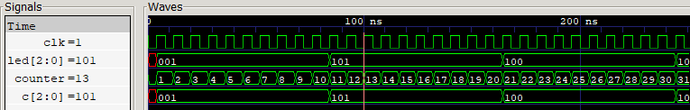

# Laboratorio 01: FPGA (Zybo Z7), Vivado/Vitis y Validación de Hardware

* **Asignatura:** Electrónica Digital II
* **Semestre:** 2026-2

## Integrantes del equipo

* **Samuel Hincapie Perilla**
* **Eduardo Felipe Camacho Lara**
* **Gabriel Alberto Rodríguez Rincón**

\---

## Contenido

1. [Instalación y configuración del proyecto](#1-instalación-y-configuración-del-proyecto)
2. [Smoke Test: semáforo en LED RGB](#2-smoke-test-semáforo-en-led-rgb)
3. [Test funcional personalizado: comparador de claves](#3-test-funcional-personalizado-comparador-de-claves)
4. [Conclusiones](#4-conclusiones)

\---

## 1\. Instalación y configuración del proyecto

Se instalaron Vivado y Vitis 2025.2 mediante el *AMD Unified Installer* y se activó la licencia **Vivado Basic Tier (Node-Locked)**.

El proyecto se creó como **RTL Project** con los siguientes parámetros:

|Parámetro|Valor|
|-|-|
|Parte|`xc7z010clg400-1`|
|Fuentes|`semaforo.v` / `comparador\_claves.v`|
|Constraints|`Zybo-Z7.xdc` (Digilent)|

\---

## 2\. Smoke Test: Semáforo en LED RGB

### 2.1 Objetivo Del Ejercicio

* Validar la correcta instalación y funcionamiento del entorno de desarrollo: Visual Studio Code, Icarus Verilog (`iverilog`) y GTKWave.
* Compilar y simular el módulo de control secuencial en Verilog (`Smoke_Test.v`) para confirmar la generación del archivo `.vcd`.
* Inspeccionar y verificar la transición temporal de las salidas de los LEDs (`led[2:0]`) e interpretar la secuencia del semáforo en el visor GTKWave.
* Verificar el flujo completo **HDL → Síntesis → Implementación → Bitstream → Programación por JTAG**, junto con el reloj de la tarjeta y el mapeo de pines del `.xdc`, usando el diseño entregado en la guía del laboratorio.

---
## 2.2 Descarga del Módulo Secuencial y Creación del Testbench:

Se descargo el archivo `Smoke_Test.v` y posteriormente se creó el archivo `tb_Smoke_Test.v` en Visual Studio Code. La función de cada uno es la siguiente:

* `Smoke_Test.v`: Módulo secuencial que conmuta la salida `led[2:0]`.
* `tb_Smoke_Test.v`: Banco de pruebas (*Testbench*) encargado de instanciar el módulo principal, generar el reloj (`clk`) y exportar los datos al archivo `.vcd`.

Un detalle importante que es necesario destacar, es que durante el desarrollo del testbench se identificó una diferencia fundamental entre el comportamiento en hardware real y la simulación virtual:

* **Hardware Real (FPGA):** Funciona a una frecuencia de reloj elevada (por ejemplo, 100 MHz que equivalen a un periodo de $10\text{ ns}$). Por lo que si se busca que los cambios de color del semáforo sean visibles al ojo humano, se requieren contadores de escala enormes (como $80\,000\,000$ de ciclos para alcanzar $0.8\text{ segundos}$).
* **Entorno de Simulación (Testbench / GTKWave):** Intentar simular $320\,000\,000$ de ciclos en un entorno virtual generaría archivos `.vcd` de varios gigabytes y exigiría tiempos de procesamiento extremadamente largos. Por esta razón, para el testbench se redujeron los límites del contador a escala de decenas de ciclos ($10, 20, 30, 40$). Esto permite validar la máquina de estados y las transiciones del semáforo en tan solo $600\text{ ns}$ de tiempo simulado sin saturar los recursos del sistema.

Teniendo en cuenta lo anterior, se crearon dos archivos `.v` para esta parte, uno denominado `Smoke_Test.v` que fue implementado para la creación y visualización del testbench y otro denominado `Smoke_Test_FPGA.v` que se usó para compilar y programar la FPGA. 

Luego se utilizó la terminal de Visual Studio Code para ejecutar la compilación del código mediante el ejecutable de Icarus Verilog (iverilog) especificando el nombre del archivo de salida compilado:
```bash
iverilog -o tb_Smoke_Test.vvp tb_Smoke_Test.v Smoke_Test.v
```
A continuación, se ejecutó el motor de simulación vvp para procesar el binario y generar el archivo `.vcd` correspondiente:
```bash
vvp tb_Smoke_Test.vvp
```
Se abrió la herramienta GTKWave y se cargó el archivo de simulación .vcd generado.
```bash
gtkwave tb_Smoke_Test.vcd
```

---

### 2.3 Simulación Virtual en GTKwave

En la siguiente imágen se observa el resultado de la simulación en gtkwave:


Como se puede ver en la imagen anterior, el comportamiento de la prueba fue el esperado, ya que la secuencia de salidas en el registro `led[2:0]` concuerda exactamente con los estados temporales programados para el semáforo.

* **Comportamiento Estado Rojo (`led = 3'b001`):** Su valor está activo desde los 0 ns hasta los 105 ns, manteniéndose durante los primeros 10 ciclos del reloj.
* **Comportamiento Estado Amarillo (`led = 3'b011`):** Su valor conmuta a los 105 ns y permanece activo hasta los 205 ns.
* **Comportamiento Estado Verde (`led = 3'b010`):** Su valor se activa en el intervalo de 205 ns a 305 ns.
* **Comportamiento Retorno a Amarillo (`led = 3'b011`):** Conmuta nuevamente a los 305 ns y se mantiene hasta los 405 ns.
* **Reinicio de ciclo:** A los 405 ns el contador vuelve a cero reiniciando la secuencia en Estado Rojo (`3'b001`), para posteriormente conmutar de nuevo a Amarillo a los 505 ns.


### 2.4 Funcionamiento del código

El módulo `Semaforo` tiene una entrada de reloj `clk` y una salida `led\[2:0]` que controla los tres canales del LED RGB LD6. Está compuesto por dos bloques síncronos:

1. **Contador:** incrementa `counter` en cada flanco de subida de `clk` y lo reinicia al llegar a 320 000 000.
2. **Selector de color:** cuando `counter` alcanza 0, 80e6, 160e6 y 240e6, cambia el valor de `led`. Entre esos instantes el registro conserva su valor, por lo que el color se mantiene.

La duración de cada estado se definió como el parámetro `N\_ESTADO` (80e6 por defecto), del cual se derivan los demás umbrales (`N\_TOTAL = 4\*N\_ESTADO`). En síntesis se usa el valor por defecto; en simulación se reduce para no simular 320 millones de ciclos.

**Temporización** (reloj de 125 MHz en el pin K17):

```
T\_clk    = 1 / f\_clk        = 1 / 125e6 Hz  = 8 ns
t\_estado = N\_estado \* T\_clk = 80e6 \* 8 ns   = 0.64 s
T\_ciclo  = N\_total  \* T\_clk = 320e6 \* 8 ns  = 2.56 s
```

|`counter`|Estado|`led = {G,B,R}`|Canal encendido|
|-|-|-|-|
|0|Rojo|`3'b001`|R|
|80 000 000|Azul|`3'b010`|B|
|160 000 000|Verde|`3'b100`|G|
|240 000 000|Azul|`3'b010`|B|


### 2.5 Mapeo de pines (`.xdc`)

Solo se habilitaron las líneas del reloj y del LED RGB LD6, que eran las únicas necesarias para esta implementación:

```tcl
## Reloj 125 MHz
set\_property -dict { PACKAGE\_PIN K17 IOSTANDARD LVCMOS33 } \[get\_ports { clk }];
create\_clock -add -name sys\_clk\_pin -period 8.00 -waveform {0 4} \[get\_ports { clk }];

## LED RGB LD6
set\_property -dict { PACKAGE\_PIN V16 IOSTANDARD LVCMOS33 } \[get\_ports { led\[0] }]; # led6\_r
set\_property -dict { PACKAGE\_PIN M17 IOSTANDARD LVCMOS33 } \[get\_ports { led\[1] }]; # led6\_b
set\_property -dict { PACKAGE\_PIN F17 IOSTANDARD LVCMOS33 } \[get\_ports { led\[2] }]; # led6\_g
```

|Señal HDL|Pin|Canal|
|-|-|-|
|`clk`|K17|Reloj del sistema (125 MHz)|
|`led\[0]`|V16|Rojo|
|`led\[1]`|M17|Azul|
|`led\[2]`|F17|Verde|

`create\_clock` informa a la herramienta que el reloj tiene un periodo de 8 ns, que es el valor que usa el análisis de tiempos durante la implementación.

### 2.6 Simulación (testbench)

Antes de programar la tarjeta, el diseño se verificó con un testbench (`src/tb\_semaforo.v`):

|Aspecto|Valor en simulación|
|-|-|
|Reloj|125 MHz (periodo de 8 ns, igual al de la tarjeta)|
|`N\_ESTADO`|10 ciclos (se sobrescribe con `#(.N\_ESTADO(10))`)|
|Ciclos verificados|3 ciclos completos (13 transiciones)|

En cada cambio de `led`, el testbench comprueba:

1. **Color:** que coincida con la secuencia rojo → azul → verde → azul.
2. **Duración:** que el estado anterior haya durado `N\_ESTADO \* T\_clk = 10 \* 8 ns = 80 ns`, o 88 ns en el caso del último azul (ver 2.2).

Al final imprime `PASO` o `FALLO` con el número de errores, y tiene un *timeout* por si el LED nunca cambia.

**Ejecución con Icarus Verilog y GTKWave**:

```bash
iverilog -g2005 -o sim tb\_semaforo.v semaforo.v
vvp sim
gtkwave tb\_semaforo.vcd
```

**Resultado:**

```
\[4.0 ns] OK: ROJO
\[84.0 ns] OK: AZUL
           duracion estado anterior = 80.0 ns
\[164.0 ns] OK: VERDE
           duracion estado anterior = 80.0 ns
\[244.0 ns] OK: AZUL
           duracion estado anterior = 80.0 ns
\[332.0 ns] OK: ROJO
           duracion estado anterior = 88.0 ns
...
SMOKE TEST (simulacion): PASO - 13 transiciones verificadas
```

**Formas de onda (GTKWave):**



* **Rojo (`001`)** desde el primer flanco (4 ns) hasta que `counter` llega a 10.
* **Azul (`010`)** desde que `counter` pasa de 10 a 11, y **verde (`100`)** desde que pasa de 20 a 21.
* **Retardo de un ciclo:** `led` es un registro; la condición `counter == N\_ESTADO` se evalúa en un flanco y el nuevo color aparece en ese mismo flanco, cuando `counter` ya vale 11. La duración de cada estado no cambia (10 ciclos = 80 ns).
* **Valor inicial:** antes del primer flanco `led` vale `X` (en rojo en GTKWave) porque el registro no tiene valor inicial. En la FPGA arranca en 0, es decir, el LED apagado durante 8 ns.

La secuencia simulada coincide con la observada en la tarjeta (sección 2.5).

### 2.7 Evidencia en hardware

https://github.com/user-attachments/assets/e99ffdbc-6585-4a58-9e17-00986aa4bfc6

Se programó el código base con los estados descomentados. Se observó la secuencia cíclica **rojo → azul → verde → azul**, con una duración aproximada de 0.64 s por estado, lo que confirma:

* Que la FPGA se programa correctamente por JTAG.
* Que el reloj de 125 MHz está presente y el `create\_clock` es coherente con la temporización observada.
* Que los tres canales del LED RGB responden y están asignados a pines válidos en el `.xdc`.

### 2.8 Observaciones

En el código base, el segundo estado se comenta como "amarillo", pero se codifica como `3'b010`, que según el `.xdc` corresponde al canal azul (M17). Por eso la secuencia observada es rojo → azul → verde → azul. El LED RGB no tiene un canal amarillo propio: para obtenerlo habría que encender R y G a la vez (`3'b101`).

\---

## 3\. Test funcional personalizado: comparador de claves

### 3.1 Descripción del diseño

El módulo `comparador\_claves` es un circuito **100 % combinacional** que toma dos operandos de 4 bits, una "clave principal" (A) fijada con los switches y una "clave ingresada" (B) formada con los botones, y sobre ellos realiza:

* Una **suma o resta** de 4 bits, cuyo resultado se muestra en `LED\[3:0]`.
* Las operaciones **AND, OR y XOR** bit a bit, cuyo resultado se resume en el LED RGB. En particular, la combinación de colores permite saber si las dos claves son **iguales**.

Un botón adicional aplica una ** XOR** que invierte B antes de operar.

### 3.2 Entradas y construcción de operandos

|Entrada|Origen|Pin(es)|Función|
|-|-|-|-|
|`sw\[3:0]`|Switches SW3–SW0 de la tarjeta|T16, W13, P15, G15|Operando **A** (clave principal)|
|`btn\[3:0]`|Botones BTN3–BTN0 de la tarjeta|Y16, K19, P16, K18|Operando **B** (clave ingresada)|
|`btn\[4]`|Pulsador externo, Pmod JC|V15|Máscara XOR: invierte B (`B ^ 4'b1111`)|
|`btn\[5]`|Pulsador externo, Pmod JC|W14|Modo aritmético: 0 = resta (por defecto), 1 = suma|

```verilog
wire \[3:0] operando\_a = sw\[3:0];
wire \[3:0] operando\_b = btn\[4] ? (btn\[3:0] ^ 4'b1111) : btn\[3:0];
```

Así, A proviene únicamente de los switches y B de los botones (con o sin inversión), y las 10 entradas afectan el resultado.

### 3.3 ¿Por qué no se usaron BTN4 y BTN5 de la tarjeta?

La Zybo Z7 tiene seis pulsadores, pero **solo BTN0–BTN3 están conectados a la lógica programable (PL)**. BTN4 y BTN5 están conectados a pines **MIO** del procesador, por lo que un diseño en Verilog no puede leerlos directamente.

#### 3.3.1 Arquitectura del Zynq-7000: PS y PL

El Zynq-7000 integra dos partes en un mismo chip:

|Parte|Qué es|Cómo se programa|
|-|-|-|
|**PS** (*Processing System*)|Procesador ARM Cortex-A9 con sus periféricos (UART, USB, Ethernet, GPIO, controlador de memoria)|Software (C/C++ en Vitis)|
|**PL** (*Programmable Logic*)|Lógica programable equivalente a una FPGA Artix-7|HDL + `.xdc` en Vivado (lo que se hace en este laboratorio)|

Cada parte tiene sus **propios pines**:

* Los pines de la **PL** son de propósito general: cualquier puerto del módulo `top` se puede asignar a ellos con `PACKAGE\_PIN` en el `.xdc`. Es el caso de los switches, BTN0–BTN3, los LEDs y los Pmod JA–JE.
* Los pines **MIO** (*Multiplexed I/O*) pertenecen al **PS**. Están cableados internamente al multiplexor de periféricos del procesador y **no tienen conexión con la lógica programable**.

#### 3.3.2 Conexión de BTN4 y BTN5

|Botón|Pin MIO|Pin del encapsulado|Banco / voltaje|Lo lee|
|-|-|-|-|-|
|BTN0–BTN3|—|K18, P16, K19, Y16|Banco de la PL, 3.3 V|PL (HDL)|
|**BTN4**|**MIO 50**|B13|Banco 501 (PS), 1.8 V|Solo el PS|
|**BTN5**|**MIO 51**|B9|Banco 501 (PS), 1.8 V|Solo el PS|

Por eso, en el archivo `Zybo-Z7.xdc` de Digilent **no existen líneas para BTN4 y BTN5**: no son pines que Vivado pueda asignar a un puerto HDL. Si se intentara forzar `PACKAGE\_PIN B13` para un puerto del `top`, la implementación fallaría porque ese pin no es una E/S de la PL.

Lo mismo ocurre con el **Pmod JF** y con el **LED LD4**: también están conectados a pines MIO, y por eso los botones externos se conectaron al Pmod **JC**, que sí pertenece a la PL.


#### 3.3.4 Solución adoptada: pulsadores externos en el Pmod JC

Se conectaron dos pulsadores externos al Pmod JC, cada uno con una resistencia de **pull-down de 10 kΩ**. Es la misma configuración que usa la tarjeta para BTN4 y BTN5, pero alimentada a 3.3 V para coincidir con el estándar `LVCMOS33` de los pines de la PL.

```
 VCC3V3 (Pmod JC)
    │
   ─┴─  pulsador
    │
    ├──────────►  JC pin 1 (Señal)
    │
   ┌┴┐
   │ │ 10 kΩ  (pull-down)
   └┬┘
    │
   GND (Pmod JC)
```

* **Sin pulsar:** la resistencia lleva el pin a 0 V → `btn = 0`.
* **Pulsado:** el pin queda conectado a 3.3 V → `btn = 1`.

Así los botones externos son activos en alto, igual que BTN0–BTN3, y el HDL los trata de la misma forma.

Líneas agregadas al `.xdc`:

```tcl
## Pulsadores externos en Pmod JC
set\_property -dict { PACKAGE\_PIN V15 IOSTANDARD LVCMOS33 } \[get\_ports { btn\[4] }]; # JC pin 1
set\_property -dict { PACKAGE\_PIN W14 IOSTANDARD LVCMOS33 } \[get\_ports { btn\[5] }]; # JC pin 7
```

### 3.4 Operaciones implementadas

```verilog
// Aritmética de 4 bits: btn\[5] = 1 -> suma, btn\[5] = 0 -> resta
wire \[3:0] res\_aritmetico = btn\[5] ? (operando\_a + operando\_b) : (operando\_a - operando\_b);

// Lógicas
wire \[3:0] res\_and = operando\_a \& operando\_b;
wire \[3:0] res\_or  = operando\_a | operando\_b;
wire \[3:0] res\_xor = operando\_a ^ operando\_b;
```

|Operación|Dónde se usa|
|-|-|
|**Suma / resta** de 4 bits|`LED\[3:0]`|
|**AND**|Canal rojo del RGB|
|**OR**|Canal verde del RGB|
|**XOR**|Canal azul del RGB e inversión de B|

El resultado aritmético es de 4 bits **sin acarreo ni préstamo**: se muestra módulo 16. Por ejemplo, `10 - 12 = -2` se ve como `1110` (complemento a 2) y `12 + 5 = 17` se ve como `0001`.

**Comparación de claves:** dos números son iguales si y solo si su XOR es cero. Por eso, cuando A = B, el canal azul (`|res\_xor`) se apaga y la igualdad se detecta automáticamente, sin importar el modo aritmético seleccionado.

### 3.5 Salidas

|Salida|Pin|Significado|
|-|-|-|
|`led\[3:0]`|LD3–LD0|Resultado de A − B o A + B|
|`led\_rgb\[0]` (R)|V16|`\|(A \& B)`: A y B tienen al menos un bit en 1 en común|
|`led\_rgb\[1]` (G)|F17|`\|(A \| B)`: al menos uno de los operandos es distinto de cero|
|`led\_rgb\[2]` (B)|M17|`\|(A ^ B)`: A y B son distintos|

Como los tres canales dependen de A y B, **solo pueden aparecer cuatro colores**. Por ejemplo, si el AND tiene algún bit en 1, el OR también lo tiene, así que el rojo nunca aparece solo:

|Condición|AND|OR|XOR|Color|Combinaciones (de 256)|
|-|-|-|-|-|-|
|A = B = 0|0|0|0|Apagado|1|
|**A = B ≠ 0 (claves iguales)**|1|1|0|**Amarillo** (R + G)|15|
|A ≠ B, sin bits en común (p. ej. complementarias)|0|1|1|Cian (G + B)|80|
|A ≠ B, con algún bit en común|1|1|1|Blanco (R + G + B)|160|

El **amarillo** indica que las claves coinciden. El caso A = B = 0 también es una igualdad, pero se ve apagado porque AND y OR son cero.

### 3.6 Simulación


### 3.7 Evidencia en hardware

Debido al peso de los videos, se subieron a Drive:

|Prueba|Video|
|-|-|
|Suma|[Ver video](https://drive.google.com/file/d/1t9L1MJck8z5sETM7WIkysCyToE96TEmu/view?usp=drive_link)|
|Resta|[Ver video](https://drive.google.com/file/d/10wHqPUYK5qbUX6gKikMrIQrhTMwL7ZEu/view?usp=drive_link)|
|Inversión (XOR)|[Ver video](https://drive.google.com/file/d/1NcaNUGEpHWUaIFor67Q67xMHiMcH-EaO/view?usp=drive_link)|
|Comparación (claves iguales)|[Ver video](https://drive.google.com/file/d/1cw_783hJGDOCyfy101v3lDOaaBDURRYa/view?usp=drive_link)|

\---

## 4\. Conclusiones


